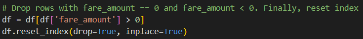
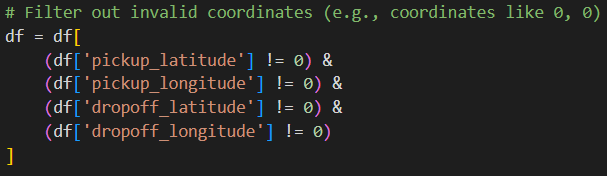
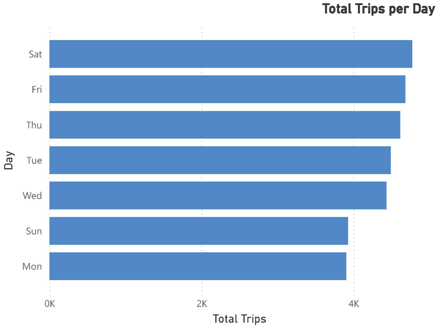
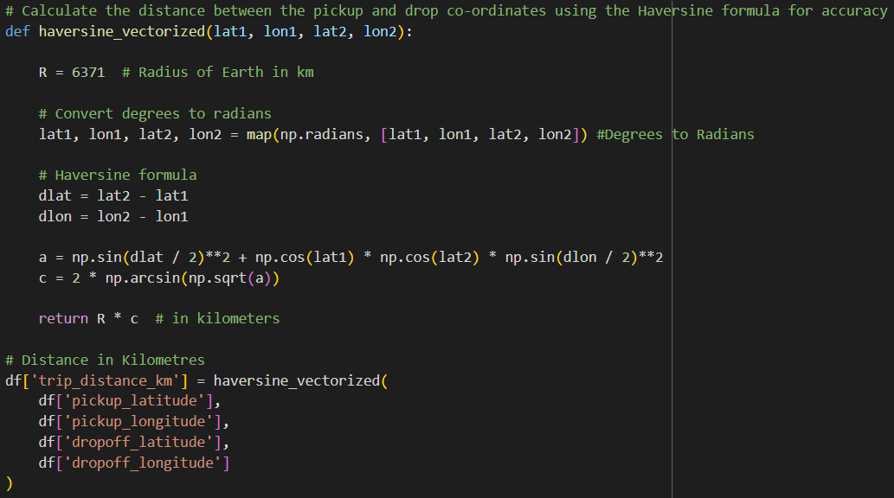

# Uber Fare Analysis

## Introduction

This project analyzes Uber trip data to uncover the key factors driving fare amounts. Using a publicly available dataset from Kaggle, we explore fare distributions, identify patterns, and examine relationships between fare and trip characteristics such as distance, time of day, and passenger count. The goal is to generate actionable, data‑driven insights that could inform Uber’s pricing and operational strategies.

## Methodology

The analysis followed a systematic approach:

1.  **Data Loading and Initial Inspection**: The dataset was loaded using pandas, and initial checks were performed to understand its structure, identify missing values, and examine data types.
    
2.  **Data Cleaning and Preparation**: Missing values were handled by dropping rows with incomplete information in critical columns. Unnecessary columns were removed.
    
    

3.  **Feature Engineering**: New features were extracted and created from existing data to enrich the analysis. These included:

    - Extracting year, month, weekday, and hour from the pickup datetime.
      

    - Categorizing trips by day.
      

    - Calculating the distance between pickup and dropoff locations.
      

4.  **Descriptive Statistics and Outlier Identification**: Calculated summary statistics (mean, median, quartiles, standard deviation) and used box plots to flag potential outliers in features like fare, distance, and coordinates.
    
5.  **Data Visualization**: Various visualizations were created to explore data distributions and relationships between variables.
6.  **Data Export**: The cleaned and processed data was exported to a new CSV file to be used in creating the Power BI dasboard.

## Analysis

### Descriptive Statistics

Descriptive statistics were generated for the numerical columns, providing insights into the data's characteristics. These included measures such as mean, median, standard deviation, quartiles, and data ranges.

- **Fare Amount**: Revealed a skew toward lower fares, with a long tail of high‑fare trips.
- **Distance Traveled**: The calculated distance between pickup and dropoff points shows a range of trip lengths. Summary statistics provide insight into the typical distance traveled and the presence of potentially long-distance outliers.
- **Passenger Count**: The distribution of passenger counts was examined, revealing the most common number of passengers per trip and the presence of trips with unusually high passenger counts.
- **Geographic Coordinates**: Descriptive statistics for latitude and longitude provide a general sense of the geographic distribution of trips.

Outliers were visually assessed using box plots for numerical features like `fare_amount`, `distance_km`, and the geographic coordinates.

### Fare Distribution Patterns

The distribution of fare amounts was visualized using a histogram, revealing the frequency of different fare values and identifying any common fare ranges or unusual spikes.

### Relationships Between Key Variables

Visualizations were created to explore the relationships between key variables:

- **Fare Amount vs. Distance Traveled**: A scatter plot illustrated the positive correlation between fare and distance, while also revealing cases of unusually high or low fares for given distances.
  
- **Fare Amount vs. Time of Day**: A bar chart compared average fares across morning, afternoon, evening, and night periods—highlighting demand‑driven differences.
  
- **Fare Amount vs. Day of the Week**: A bar plot displayed the average fare amount for each day of the week, indicating if there are variations in fare based on the day.
  

## Power BI Dashboard Overview

To complement this notebook analysis, a Power BI dashboard was built to provide an interactive, at‑a‑glance view of key metrics and trends:

1. **Year Selector**
   Buttons allow users to choose any year between 2009 and 2015, dynamically updating all visuals.

2. **KPI Cards**

   - Total Fare (e.g., $320.6 K)

   - Total Passenger Count (e.g., 51 K)

   - Average Distance (km) (e.g., 6.35 km)

   - Total Trips (e.g., 31 K)

3. **Total Fare by Month**
   An area chart shows monthly fare totals, highlighting seasonal peaks and troughs.

4. **Fare vs. Period of Day**
   A bar chart compares total fare revenue across morning, afternoon, evening, and night, illustrating demand fluctuations.

5. **Total Fare per Season**
   A donut chart breaks down annual fare by season, revealing which quarter contributes most revenue.

6. **Average Fare per Hour**
   An hourly line chart displays how mean fares change over a 24‑hour cycle, pinpointing peak pricing hours.

7. **Total Trips per Day**
   A horizontal bar chart ranks days of the week by trip volume, identifying the busiest and quietest days.

**Interactivity:** Selecting any chart element filters the entire dashboard, enabling deep dives. This dashboard empowers stakeholders to monitor performance, spot anomalies, and make informed operational decisions in real time.

## Results

The analysis revealed several key findings:

- The distribution of fare amounts is skewed, with a concentration of trips in lower fare ranges and a tail extending to higher fares, indicating the presence of some expensive trips.
- There is a general positive correlation between fare amount and distance traveled, as expected. However, the scatter plot showed some variability and potential outliers where fare amounts were high for relatively short distances or vice versa.
- The average fare amount appears to vary depending on the time of day and the day of the week, suggesting that demand or pricing strategies might differ across these periods. Peak hours or specific days might have higher average fares.
- Outliers were identified in several numerical features, including fare amount, distance, and geographic coordinates. These outliers warrant further investigation to understand their cause and decide on appropriate handling.

## Conclusion

This analysis sheds light on Uber fare dynamics, confirming that trip distance and timing significantly influence revenue. Feature engineering enabled nuanced insights by season and time period, while outlier detection flags data quality or operational anomalies.

## Recommendations

Based on this analysis, here are some potential data-driven business recommendations:

- **Dynamic Pricing**: Leverage the insights on fare variations based on time of day and day of the week to optimize dynamic pricing strategies. Consider higher surge pricing during identified peak periods or days with higher average fares.
- **Outlier Investigation**: Investigate the identified outliers in fare amount and distance. High fare/short distance trips might indicate issues like traffic or unusual routes, while low fare/long distance trips could be promotions or data errors. Understanding these can help refine pricing models and identify potential service issues.
- **Geographic Analysis**: Further analyze the geographic distribution of fares and distances to identify high-demand areas or routes that could benefit from targeted marketing or driver allocation strategies.
- **Passenger Count Analysis**: Explore the relationship between passenger count and fare amount. While not directly impacting fare in all models, understanding group travel patterns could inform vehicle capacity planning or shared ride options.
- **Temporal Trend Analysis**: Analyze fare trends over longer periods (months, years) to identify seasonality or long-term changes in pricing or demand.
